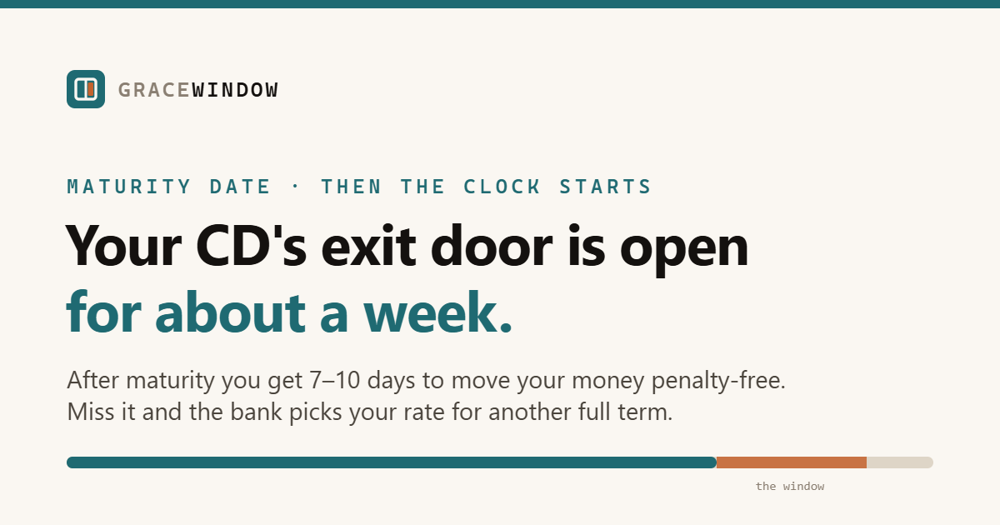

# GraceWindow

**Live tool: https://ababa1326.github.io/gracewindow/**

When a CD matures, the penalty-free exit window is usually only 7–10 days. GraceWindow
shows exactly when that grace period opens and closes before the CD auto-renews for
another term.

## What it does

- Enter your CD balance, maturity date, and bank's grace-period length
- See the exact penalty-free window for withdrawing, moving, or changing the CD
- Compare the bank's renewal APY with a better available rate
- Estimate the extra interest available by moving the balance
- Download a one-time calendar reminder for two days before maturity

## Privacy

Everything runs in your browser. No accounts, no server, no analytics, no connection
to your bank — the numbers you type never leave the page.

## Tech

One self-contained `index.html`. Vanilla JavaScript, zero dependencies, no build step.
Hosted free on GitHub Pages.

## Related

[ZeroEnds](https://github.com/ababa1326/zeroends) calculates what to pay before a 0% APR
promo ends. [ReportsLow](https://github.com/ababa1326/reportslow) calculates what to pay
before a credit card balance is reported.

---

*Educational tool, not financial advice. Confirm grace-period lengths, renewal rates,
and early-withdrawal penalties with your bank.*
